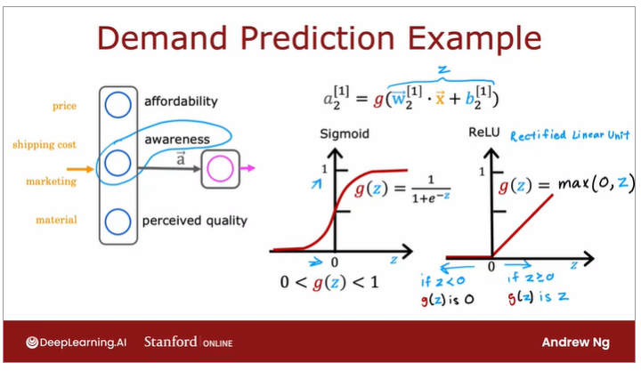
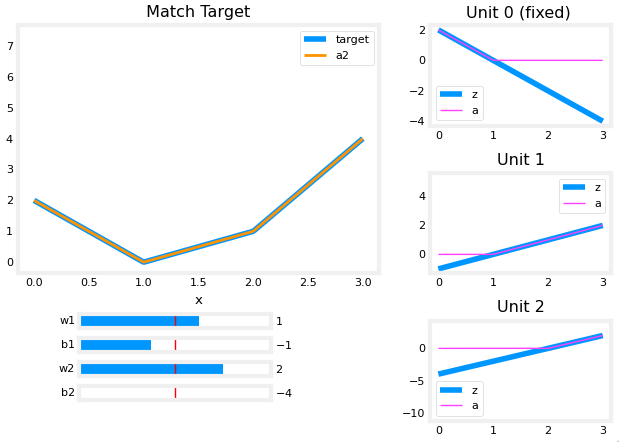
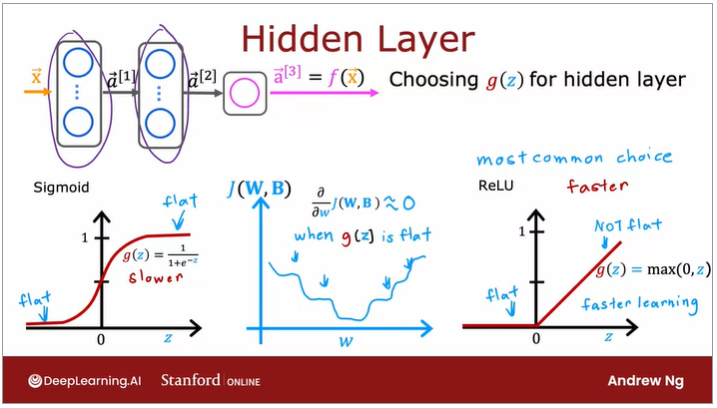
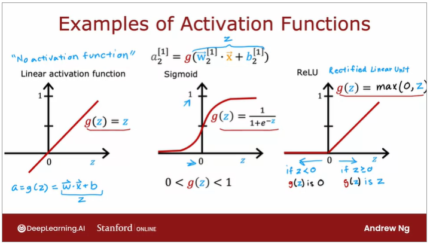
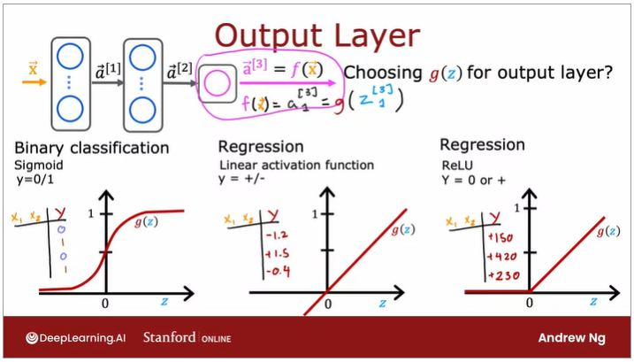
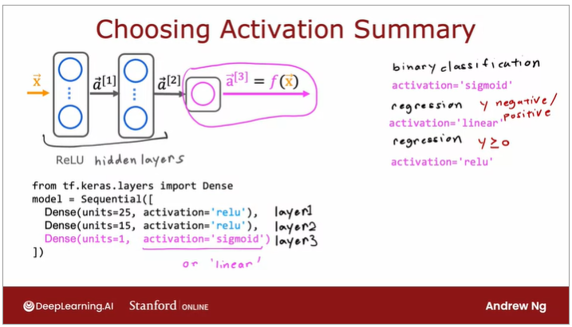

# Activation Functions

- **Sigmoid: 0 < g(z) < 1**

Best for on/off or binary situations.

- **ReLU: g(z) = max(0, z)**

The most common choice for the *hidden layers* of a neural network. It provides a continuous linear relationship while having an 'off' range where the output is zero. This 'off' feature makes the ReLU a Non-Linear activation, which provides the needed ability to turn functions off until they are needed and enables models to stitch together linear segments to model complex non-linear functions.

Moreover, the ReLU function is computationally less intensive since (i) it just requires computing max(0, z) whereas the sigmoid function requires taking an exponentiation and then an inverse, and (ii) by being flat *only* in one part of the graph (instead of two as in the sigmoid function) the gradient descent converges faster.

- **Linear Activation Function g(z) = z**

## Choosing Activation Functions
- - - -

