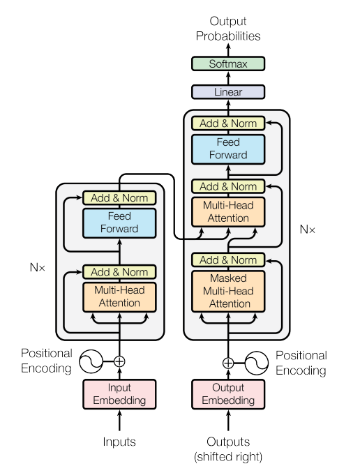

# Transformer: The Building Block for NLP Models
*[Summary of the Transformer publications listed in the references below]*

The Transformer is an encoder-decoder architecture aimed at reducing sequential computation (to speed-up the training time). It was introduced by Google and the University of Toronto in 2017, and has been widely used in Natural Language Processing tasks such as machine translation, reading comprehension, abstractive summarization, and text classification.

The core contribution of the Transformer is the use a **self-attention mechanism**, which allows the model to learn the relevance and context of all words (tokens) in an input, not just the neighboring words. It achieves this through attention weights (learned during the training phase) that determine the importance of each word to one another (irrespectively of their position). 

This approach results in **higher accuracy, improved computational performance, and better understanding of the flow of information** when compared to Recurrent Neural Networks (RNNs) and Convolutional Neural Networks (CNNs), which process input sequentially and do not have a way to explicitly consider the relationships between words. In particular:

- RNNs struggle to fully take advantage of modern fast computing devices such as TPUs and GPUs, due to their sequential nature. This limits RNNs by the amount of computation and memory needed, which increases exponentially with the window of text that the model sees.
- CNNs are much less sequential than RNNs, but in most cases the number of steps required to combine information is correlated to the distance to the input (linearly for ConvS2S and logarithmically for ByteNet), which makes it more difficult to learn dependencies between distant positions.  

  In contrast, the Transformer only performs a small, constant number of steps (chosen empirically), albeit at the cost of reduced effective resolution due to averaging attention-weighted positions. An effect that is addressed with Multi-Head Attention.
- Transformers allow to visualize what word(s) of a sentence the encoder attends to, when computing the final representation of a word. This allows to address the notoriously known phenomenon of **coreference resolution** in machine translation, wherein a word might refer to a different word depending on the meaning of the antecedent(s).

# Model Architecture

The Transformer follows a stacked encoder-decoder architecture using Multi-Head Self-Attention Mechanism, and Position-Encoding and Position-Wise Feed Forward Neural Networks.

  

The Transformer Architecture (source: https://arxiv.org/pdf/1706.03762.pdf)

## Embedding Layer

Before processing text, words are tokenized and converted into numerical representations named tokens. These tokens are then passed through an embedding layer, a trainable vector embedding space, that assigns vectors to each token, encoding their meaning and context. Positional encoding is added to preserve word order information since the model processes each input token in parallel. 

## Encoder

The encoder processes the input sequence and produces a sequence of hidden states. It is composed of a stack of N = 6 identical layers (each comprising two sub-layers). 

The first sublayer is a **multi-head self-attention**. Each attention head in a multi-head attention layer processes a different subset of the input, allowing the model (i) to attend to different patterns or relationships, and (ii) to effectively process long sequences of text by considering multiple aspects of the input simultaneously. In practice, it is intended that each attention head learns (by itself) a different aspect of the language by capturing a contextual dependency. While the number of attention heads included in the attention layer varies from model to model, it is typically in the range of 12-100.

The output is then passed through a **feedforward neural network** and a **softmax layer** where it is normalized to obtain probability scores for each token in the vocabulary. The highest-scoring token is the most likely predicted token, although different selection methods can be employed.

## Decoder

The decoder is also composed of a stack of N = 6 identical layers (with different weights though). In addition to the two sub-layers present in the encoder layers, it inserts a third sub-layer, which performs **multi-head attention over the output of the encoder stack**. Similar to the encoder, the decoder employs residual connections around each of the sub-layers, followed by layer normalization.

The self-attention sub-layer in the decoder stack prevents positions from attending to subsequent positions. This masking, combined with the offset by one position of the output embeddings, ensures that the predictions for position ii can depend only on the known outputs at positions less than ii.

## Self-Attention Mechanism

An attention function can be described as mapping a query and a set of key-value pairs to an output, wherein the query, keys, values, and output are all vectors. The output is computed as a weighted sum of the values, where the weight assigned to each value is computed by a compatibility function of the query with the corresponding key.

There are two types of attention mechanisms used in the Transformer architecture: **self-attention** and **encoder-decoder attention**.

The **self-attention** mechanism allows the model to directly consider the relationships between input words (or tokens) at different positions in the input sequence, rather than relying on a fixed-length context window or recurrence. This enables the Transformer to **process input sequences of arbitrary length** and **results in a more effective handling of long-range dependencies**.

This process can be described as follows:

1. The input sequence is passed through an embedding layer, which maps the input tokens to a high-dimensional space. In practice it is implemented as a lookup table that maps each input token to a 512 size embedding vector.

2. Positional encoding is used to record the relative or absolute position information of the tokens in the sequence (convolutional and recurrent architectures infer the position of the tokens by processing the input word by word in a sequencial manner).

3. The query, key, and value representations are used to compute the attention weights using a dot-product (of the query vector with the key vector of the respective word) followed by a normalization step.

4. The attention weights are used to compute a weighted sum of the value representations, which is input to the feedforward neural network.

The **encoder-decoder attention** is used in the decoder layer to attend to the hidden states produced by the encoder (from where the keys and values are coming).

## Which contextual dependencies or aspects of the language are typically learned by the multi-head self-attention layer?

The specific dependencies and aspects learned are not predetermined but are discovered through training, this includes typically:

- Syntactic relationships: e.g. subject-verb or noun-adjective relationships, which helps the model understand the grammatical structure of sentences.

- Semantic relationships: understand the meaning and associations between different terms.

- Coreference resolution: learn to associate pronouns with their corresponding antecedents, allowing it to correctly interpret sentences with references to previously mentioned entities.

- Word order and sentence structure: allowing the model to capture the order and hierarchy of phrases and clauses.

- Long-range dependencies: capture dependencies between distant words in a sentence.

- Contextual nuances: such as sarcasm, irony, or sentiment, by attending to specific words or phrases that carry such meaning.

# References
- [Attention Is All You Need](https://arxiv.org/pdf/1706.03762.pdf)
- [Transformer: A Novel Neural Network Architecture for Language Understanding](https://ai.googleblog.com/2017/08/transformer-novel-neural-network.html)
- [The Annotated Transformer](http://nlp.seas.harvard.edu/annotated-transformer/)
- [The Illustrated Transformer](https://jalammar.github.io/illustrated-transformer/)