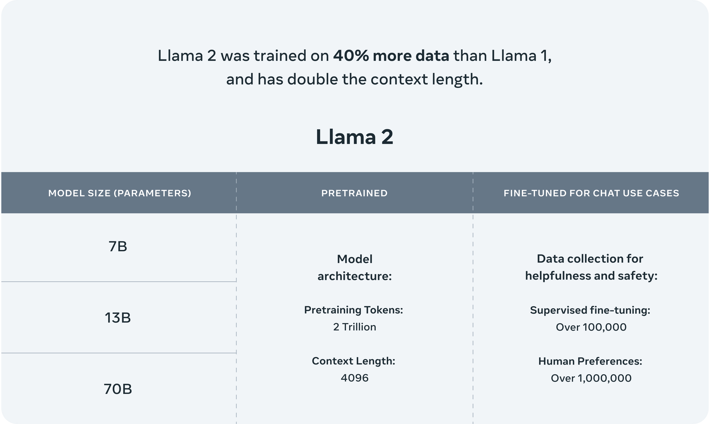
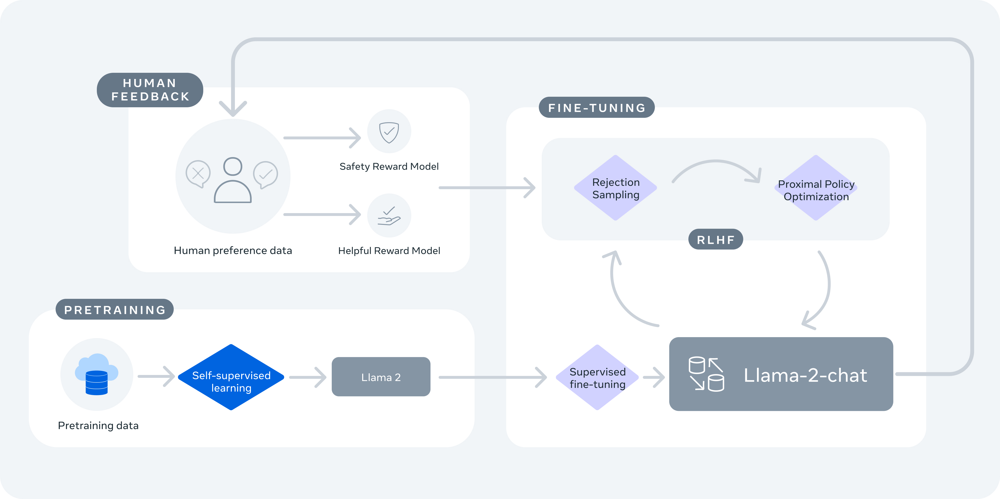

# Llama 2: Open Foundation and Fine-Tuned Chat Models

 Llama 2 is a collection of pretrained and fine-tuned large language models (LLMs) ranging in scale from 7 billion to 70 billion parameters.

 Llama 2 pretrained models were trained on 2 trillion tokens, and have double the context length than Llama 1. Its fine-tuned models have been trained on over 1 million human annotations.* 

*(source: https://ai.meta.com/llama/#inside-the-model)*

# Training

 *(source: https://ai.meta.com/resources/models-and-libraries/llama/)*

Llama 2 was pretrained using publicly available online data. An initial version of Llama-2-chat was supervised fine-tuning. Next, Llama-2-chat was iteratively refined using RLHF, which included rejection sampling and proximal policy optimization (PPO). 

# References

- [Llama by Meta](https://ai.meta.com/llama/)
- [Llama Recipes](https://github.com/facebookresearch/llama-recipes/)
- [Github Code](https://github.com/facebookresearch/llama)